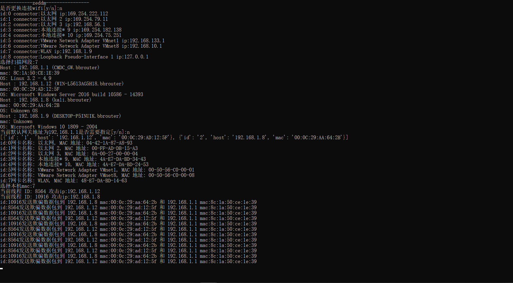
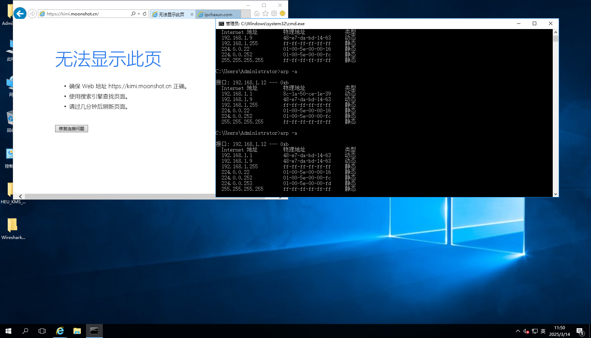
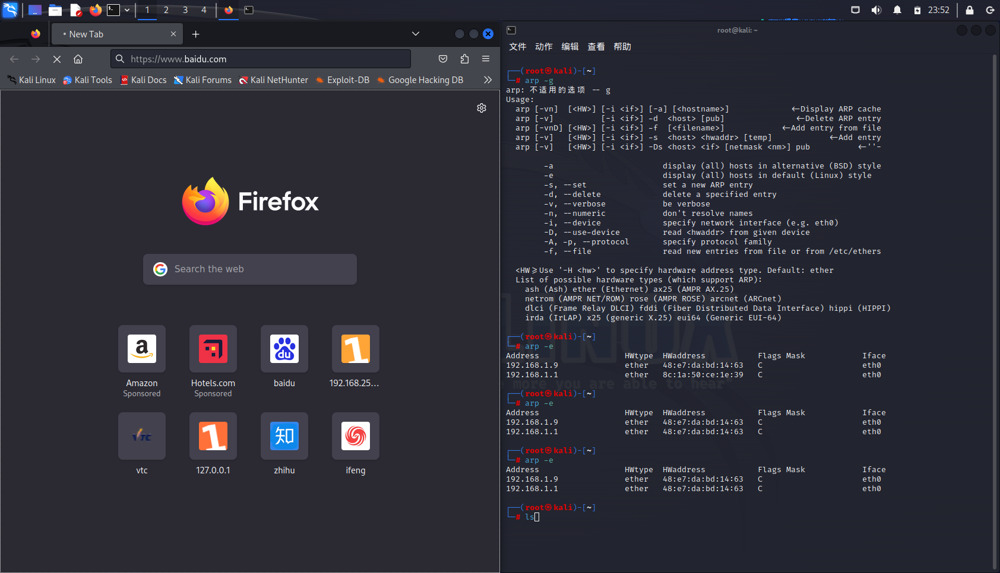

**[LAN_Arp_Attack](https://github.com/Zeddm-afk/LAN_Arp_Attack)** 

简介:扫描局域网存活主机，实现多线程arp污染局域网


依赖安装:

```
pip install netifaces python-nmap psutil scapy
```


使用:

```
LAN_arp_attack.py
```


演示：








